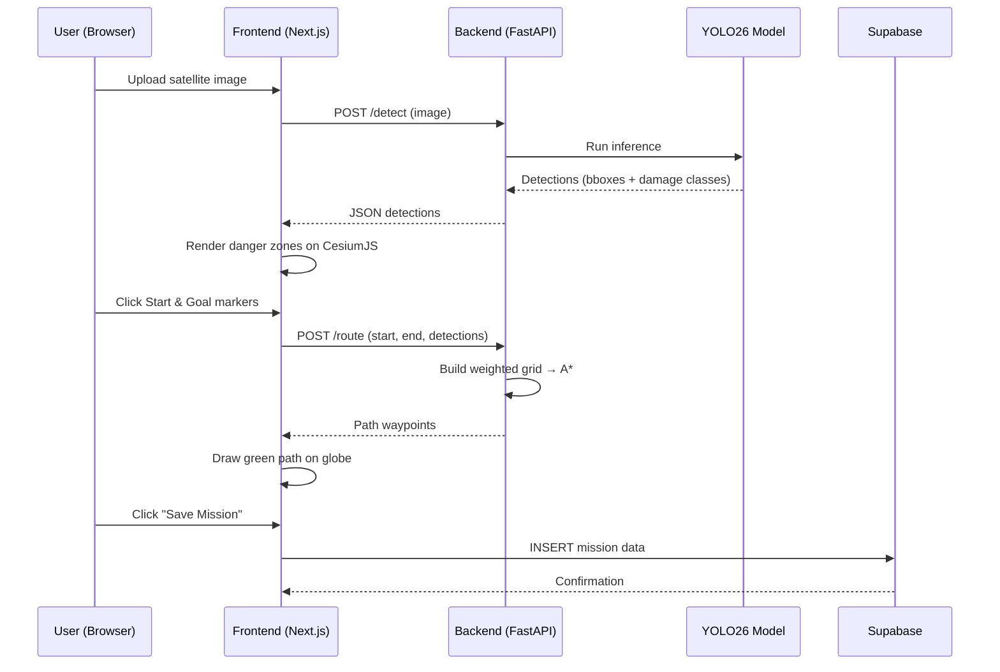

# SafeRoute — Disaster-Aware Navigation System

A satellite-imagery-powered system that detects building damage via YOLO26, visualizes danger zones on a 3D globe, and computes the safest walking route through disaster areas using Weighted A*.

## Team Roles

| Role | Person | Scope |
|---|---|---|
| **Backend** (AI & Nav Specialist) | TBD | Python: data pipeline, YOLO26 training, pathfinding API |
| **Frontend** (Full-Stack & 3D Viz) | TBD | Next.js + CesiumJS: 3D map, heatmap, UI, Supabase integration |

---

## Tech Stack

| Layer | Technology | Justification |
|---|---|---|
| Detection | **YOLO26** (Ultralytics `yolo26s.pt`) | NMS-free, STAL module for small buildings in satellite imagery |
| 3D Engine | **CesiumJS** | Cesium Ion terrain, global GeoTIFF, free for non-commercial |
| Pathfinding | **Weighted A*** | Deterministic, easy to inject per-cell danger costs |
| Frontend | **Next.js 15 + Tailwind 4** | Fast routing, SSR, modern component model |
| Backend API | **FastAPI** | Async, auto-docs, easy file upload endpoints |
| Database | **Supabase** (PostgreSQL + PostGIS) | Spatial queries, auth, storage — free tier sufficient |
| Queue (optional) | **BullMQ / Celery** | Offload long YOLO inference to background workers |

---

## Dataset Inventory (Already Downloaded)

```
d:\School_Project\Yhacks\data\
├── train_images_labels_targets\train\
│   ├── images\   (91 PNGs, 1024×1024, pre/post disaster)
│   ├── labels\   (89 JSONs, GeoJSON + WKT polygons)
│   └── targets\
└── test_images_labels_targets\   (tar, ~2.8 GB)
```

- **Label format**: GeoJSON with `subtype` field → `no-damage | minor-damage | major-damage | destroyed | un-classified`
- **Metadata**: includes `gsd`, `disaster_type`, `sensor`, `capture_date`
- **Images**: 1024×1024 PNG satellite tiles (WorldView-03)

---

## Proposed Changes

### Component 1 — Data Pipeline & YOLO Training (Backend Person)

#### [NEW] `backend/scripts/convert_xview2_to_yolo.py`

Converts xView2 GeoJSON labels into YOLO format. Key logic:

1. Parse each `_post_disaster.json` label file
2. Extract WKT polygons from `xy` features (pixel coords)
3. Compute bounding box from polygon vertices → `(x_center, y_center, w, h)` normalized to `[0,1]`
4. Map `subtype` → class ID:

| subtype | class_id | Danger Weight |
|---|---|---|
| `no-damage` | 0 | 1× |
| `minor-damage` | 1 | 3× |
| `major-damage` | 2 | 6× |
| `destroyed` | 3 | 10× |
| `un-classified` | — | skip |

5. Write one `.txt` per image: `class x_center y_center width height`
6. Generate `data.yaml` pointing to train/val splits

> [!IMPORTANT]
> Only use `_post_disaster` images+labels (that's where damage exists). Pre-disaster images have no damage annotations.

---

#### [NEW] `backend/training/train.py`

Fine-tune YOLO26 on the converted dataset:

```python
from ultralytics import YOLO

model = YOLO("yolo26s.pt")          # Small model — good speed/accuracy tradeoff
model.train(
    data="data.yaml",
    imgsz=1024,                      # Native resolution of xView2 tiles
    epochs=50,
    batch=4,                         # Adjust for GPU VRAM
    optimizer="MuSGD",               # 2026 optimizer for fast convergence
    device=0,
    project="runs/damage_detect",
    name="yolo26s_xview2"
)
```

Output: `runs/damage_detect/yolo26s_xview2/weights/best.pt`

---

#### [NEW] `backend/app/main.py` — FastAPI Server

| Endpoint | Method | Description |
|---|---|---|
| `/detect` | POST | Upload image → run YOLO → return detections JSON |
| `/route` | POST | `{start, end, detections}` → Weighted A* → return path coords |
| `/health` | GET | Healthcheck |

**Detection response schema:**
```json
{
  "detections": [
    {
      "bbox": [x1, y1, x2, y2],
      "class": "destroyed",
      "danger_weight": 10,
      "confidence": 0.92
    }
  ]
}
```

---

#### [NEW] `backend/app/pathfinding.py` — Weighted A*

1. **Grid generation**: Divide the image into an N×N grid (e.g., 64×64 cells)
2. **Danger overlay**: For each cell, accumulate danger weights from overlapping detections
3. **Cost function**: `f(n) = g(n) + h(n)` where `g(n) = distance + (danger_weight × cell_penalty)`
4. **Output**: Ordered list of `(x, y)` waypoints forming the safest path

```
Total Cost = Distance + (Danger_Weight × Cell_Penalty_Multiplier)
```

Where `Cell_Penalty_Multiplier` is a tunable constant (default: `5.0`).

---

#### [NEW] `backend/app/models.py` — Pydantic Schemas

Request/response models for all endpoints. Validates with Pydantic v2.

---

#### [NEW] `backend/requirements.txt`

```
fastapi>=0.110
uvicorn[standard]
ultralytics>=8.3
numpy
shapely
python-multipart
pydantic>=2.0
```

---

### Component 2 — Frontend & 3D Visualization (Frontend Person)

#### [NEW] `frontend/` — Next.js 15 App

Initialize with:
```bash
npx -y create-next-app@latest ./ --ts --tailwind --app --eslint --src-dir --import-alias "@/*"
```

---

#### [NEW] `frontend/src/app/page.tsx` — Landing / Dashboard

- Hero section with project name & description
- "New Mission" CTA button
- List of saved missions from Supabase

---

#### [NEW] `frontend/src/app/mission/page.tsx` — Main Mission View

The core interactive page:

1. **Image Upload Panel** — drag-and-drop satellite image
2. **CesiumJS 3D Globe** — renders terrain with:
   - Semi-transparent red polygons over damaged buildings (opacity ∝ danger weight)
   - Green path polyline for the safe route
   - Clickable markers for Start/Goal
3. **Sidebar Controls**:
   - Toggle 2D ↔ 3D view
   - Danger legend (color scale: green → yellow → red)
   - "Calculate Route" button
   - "Save Mission" button

---

#### [NEW] `frontend/src/components/CesiumMap.tsx`

Wrapper around CesiumJS `Viewer`:
- Initialize `Cesium.Viewer` with terrain provider
- Methods: `addDangerZone(polygon, dangerLevel)`, `drawPath(waypoints)`, `setMarker(type, coords)`
- Heatmap layer using `Cesium.Entity` with `PolygonGraphics` and color-coded materials

---

#### [NEW] `frontend/src/components/ImageUpload.tsx`

Drag-and-drop component → calls `POST /detect` → stores detections in state.

---

#### [NEW] `frontend/src/components/MissionSidebar.tsx`

Controls panel: route calculation trigger, 2D/3D toggle, danger legend, save button.

---

#### [NEW] `frontend/src/lib/supabase.ts`

Supabase client initialized with env vars. Handles:
- `saveMission(detections, path, metadata)` → inserts into `missions` table
- `getMissions()` → fetches all saved missions
- `getMission(id)` → fetches a single mission with its detections and path

---

#### [NEW] Supabase Schema (run via Supabase dashboard or migration)

```sql
CREATE TABLE missions (
  id UUID DEFAULT gen_random_uuid() PRIMARY KEY,
  name TEXT NOT NULL,
  created_at TIMESTAMPTZ DEFAULT now(),
  image_url TEXT,
  detections JSONB,
  path JSONB,
  start_point GEOGRAPHY(Point, 4326),
  end_point GEOGRAPHY(Point, 4326),
  metadata JSONB
);
```

---

## Project Directory Structure

```
d:\School_Project\Yhacks\
├── backend\
│   ├── app\
│   │   ├── main.py              # FastAPI app
│   │   ├── pathfinding.py       # Weighted A*
│   │   └── models.py            # Pydantic schemas
│   ├── scripts\
│   │   └── convert_xview2_to_yolo.py
│   ├── training\
│   │   └── train.py
│   └── requirements.txt
├── frontend\
│   ├── src\
│   │   ├── app\
│   │   │   ├── page.tsx         # Dashboard
│   │   │   └── mission\
│   │   │       └── page.tsx     # Mission view
│   │   ├── components\
│   │   │   ├── CesiumMap.tsx
│   │   │   ├── ImageUpload.tsx
│   │   │   └── MissionSidebar.tsx
│   │   └── lib\
│   │       └── supabase.ts
│   └── package.json
└── data\                        # Already exists
    ├── train_images_labels_targets\
    └── test_images_labels_targets\
```

---

## Integration Data Flow



---

## Phase-by-Phase Timeline

### Phase 1 — Foundation (Day 1)

| Backend | Frontend |
|---|---|
| Write `convert_xview2_to_yolo.py` | Scaffold Next.js + install CesiumJS |
| Convert dataset, validate `.txt` labels | Build `CesiumMap.tsx` with basic terrain |
| Start YOLO26 training | Build `ImageUpload.tsx` component |

### Phase 2 — Core Logic (Day 1–2)

| Backend | Frontend |
|---|---|
| Build `POST /detect` endpoint | Wire upload → `/detect` → render detections |
| Implement Weighted A* pathfinding | Build danger zone overlay (red polygons) |
| Build `POST /route` endpoint | Wire Start/Goal clicks → `/route` → draw path |

### Phase 3 — Polish & Persist (Day 2)

| Backend | Frontend |
|---|---|
| Tune model / optimize inference speed | Supabase integration (save/load missions) |
| Add error handling & input validation | Dashboard with saved missions list |
| Deploy API (Railway / Render) | 2D ↔ 3D toggle, danger legend, final UX polish |

---

## Verification Plan

### Automated Tests

1. **Data conversion validation** — After running `convert_xview2_to_yolo.py`:
   ```bash
   python -c "
   import os
   labels_dir = 'data/yolo_labels/train/labels'
   count = len([f for f in os.listdir(labels_dir) if f.endswith('.txt')])
   print(f'Generated {count} label files')
   # Spot-check one file
   with open(os.path.join(labels_dir, os.listdir(labels_dir)[0])) as f:
       for line in f:
           parts = line.strip().split()
           assert len(parts) == 5, f'Bad format: {line}'
           cls, xc, yc, w, h = int(parts[0]), *[float(x) for x in parts[1:]]
           assert 0 <= cls <= 3
           assert all(0 <= v <= 1 for v in [xc, yc, w, h])
   print('Validation passed')
   "
   ```

2. **YOLO training smoke test** — Train for 1 epoch and verify output:
   ```bash
   cd backend && python -c "
   from ultralytics import YOLO
   model = YOLO('yolo26s.pt')
   results = model.train(data='data.yaml', epochs=1, imgsz=640, batch=2)
   print('Training completed, best weights saved')
   "
   ```

3. **FastAPI endpoint tests** — Run with `pytest`:
   ```bash
   cd backend && pytest tests/ -v
   ```
   *(Tests to be written for `/detect` and `/route` endpoints with sample data)*

4. **Frontend build check**:
   ```bash
   cd frontend && npm run build
   ```

### Manual Verification

1. **Visual detection check**: Upload a known `_post_disaster.png` image through the UI → verify red polygons appear over visibly damaged buildings
2. **Path sanity check**: Set start and goal on opposite sides of a danger zone → verify the green path routes *around* the red zones, not through them
3. **Save/Load round-trip**: Save a mission → refresh → load it from the dashboard → verify detections and path re-render correctly

> [!TIP]
> For the hackathon demo, pre-load 2–3 dramatic before/after images (e.g., `guatemala-volcano`, `hurricane-florence`) so the judges see results immediately without waiting for inference.

---

## User Review Required

> [!IMPORTANT]
> **Team Assignment**: Please assign your two team members to the **Backend** and **Frontend** roles described above so we can begin building.

> [!WARNING]
> **GPU Requirement**: YOLO26 training requires a CUDA-capable GPU. If neither team member has one locally, we should plan to use Google Colab (free T4) or a cloud GPU instance for training. Inference can run on CPU for the demo but will be slower (~2-5s per image vs ~100ms on GPU).

1. **CesiumJS vs Mapbox GL JS**: The plan uses CesiumJS for the 3D globe. Mapbox GL JS v3 is an alternative with a simpler API but requires a paid API key. Which do you prefer?
2. **Supabase**: Are you already set up with a Supabase project, or should I include setup instructions?
3. **Deployment target**: Will you demo locally, or deploy to Railway/Vercel for the hackathon?
