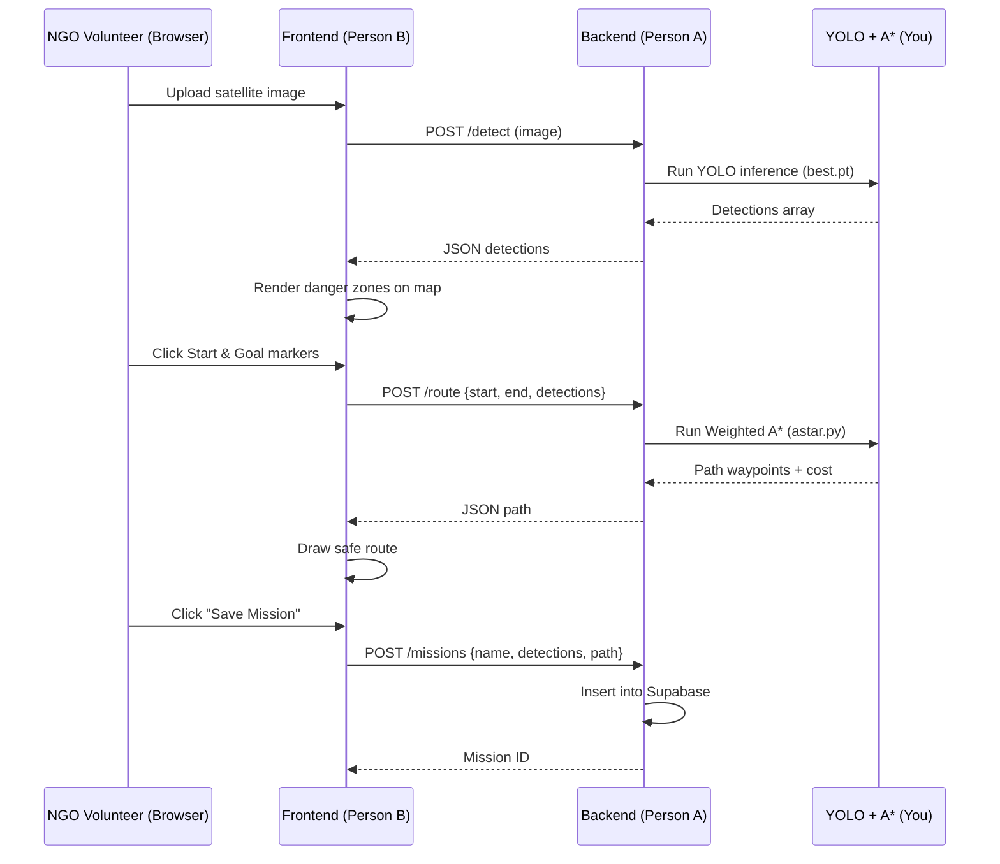

# SafeRoute — Satellite-Based Disaster Navigation System

## Project Idea

### The Problem

When a natural disaster strikes — an earthquake, hurricane, volcanic eruption — NGO volunteers on the ground need to navigate through devastated areas to deliver aid, locate survivors, and coordinate relief. Roads are blocked by collapsed buildings, bridges are destroyed, and entire neighborhoods become impassable. Currently, responders rely on outdated maps and word-of-mouth reports, wasting critical time and risking lives by walking into danger zones they cannot assess remotely.

### The Solution

**SafeRoute** is a real-time disaster navigation and situational awareness platform that uses satellite imagery and AI-driven pathfinding to assist NGOs operating in disaster zones.

1. **See the Damage** — A YOLO11s-seg instance segmentation model scans post-disaster satellite images and identifies every damaged building with **exact polygon footprints**, classifying them by severity: _no damage_, _minor_, _major_, or _destroyed_. Because xView2 labels provide exact building polygons, instance segmentation produces hyper-accurate danger zones that leave adjacent streets open for routing.
2. **Map the Danger** — Those detections are projected onto a map as color-coded danger zones (green to yellow to orange to red), giving volunteers an instant tactical overview of the disaster area. This can be rendered as a 3D globe via CesiumJS or as a simpler 2D color-coded danger map.
3. **Find the Safe Path** — A Weighted A\* pathfinding algorithm computes the safest route that avoids high-danger zones, factoring in the severity of surrounding damage as a "cost penalty."

The result: a volunteer uploads a satellite image, sees exactly where the destruction is, and gets an optimal safe route from point A to point B — all in seconds.

### Why It Matters

- **Saves lives** by routing people away from structurally compromised areas
- **Saves time** by eliminating manual scouting of blocked routes
- **Scales globally** — works on any satellite imagery, any disaster type
- **Open data** — built on the xView2 dataset (US Dept. of Defense), freely available

---

## Team Structure and Responsibilities

### You (AI and Pathfinding Lead)

**Scope**: The brain of the system — everything that thinks.

| Responsibility            | Details                                                                                                                                                                                                       |
| ------------------------- | ------------------------------------------------------------------------------------------------------------------------------------------------------------------------------------------------------------- |
| **Dataset preparation**   | Convert xView2 GeoJSON labels to YOLO segmentation format using `convert_xview2_to_yolo_seg.py`. Convert **both** pre-disaster (all buildings → class 0) and post-disaster (use damage subtype) to avoid bias |
| **Model fine-tuning**     | Fine-tune YOLO11s-seg on the xView2 damage dataset, tune hyperparameters, validate mask mAP                                                                                                                   |
| **Pathfinding algorithm** | Implement Weighted A\* that takes detection output + start/end coordinates and returns the safest path                                                                                                        |
| **Model serving**         | Package the trained model so the backend can call it for inference                                                                                                                                            |
| **Integration**           | Define the exact JSON schemas that connect model output to the backend API                                                                                                                                    |

**Deliverables**: Trained `best.pt` weights, `pathfinding.py` module, `convert_xview2_to_yolo.py` script

---

### Person A — Backend Engineer

**Scope**: The spine of the system — the API layer, data pipeline, and database.

**Job Description**: You are responsible for building the FastAPI server that connects the AI models to the frontend. You will create REST API endpoints that accept satellite images, forward them to the YOLO model for inference, run the pathfinding algorithm, and return structured JSON results. You will also design and manage the Supabase (PostgreSQL + PostGIS) database schema for persisting missions, detections, and routes. You should be comfortable with Python, REST APIs, and basic database operations.

| Responsibility           | Details                                                                         |
| ------------------------ | ------------------------------------------------------------------------------- |
| **FastAPI server**       | Build and maintain `main.py` with all API endpoints                             |
| **`POST /detect`**       | Accept image upload, call YOLO model, return detections JSON                    |
| **`POST /route`**        | Accept start/end coords + detections, call pathfinding module, return path JSON |
| **`POST /missions`**     | Save a complete mission (detections + path + metadata) to Supabase              |
| **`GET /missions`**      | List all saved missions                                                         |
| **`GET /missions/{id}`** | Retrieve a specific mission                                                     |
| **Database schema**      | Design `missions` table with PostGIS geography columns                          |
| **Supabase setup**       | Initialize project, configure env vars, set up storage bucket for images        |
| **Error handling**       | Input validation, file size limits, graceful error responses                    |
| **CORS config**          | Allow frontend origin in development and production                             |

**Tech you will use**: Python, FastAPI, Pydantic v2, Supabase (PostgreSQL), `python-multipart`, `uvicorn`

**Deliverables**: Working API server with all endpoints, Supabase schema, API documentation (auto-generated by FastAPI)

---

### Person B — Frontend Engineer

**Scope**: The face of the system — the map interface, UI, and user experience.

**Job Description**: You are responsible for building the Next.js web application with a map-based visualization layer. The primary goal is CesiumJS for 3D globe visualization, but if that is out of scope, a simpler 2D color-coded danger map (using a library like Leaflet or plain Canvas) is an acceptable alternative. You will create an interactive map where users can upload satellite images, see AI-detected damage zones as colored overlays, set start and goal points, and view the computed safe route. You will also build the mission dashboard (save and load past missions) and ensure the UI is polished and demo-ready. You should be comfortable with React, TypeScript, and willing to work with map or geospatial libraries.

| Responsibility             | Details                                                                                                                                            |
| -------------------------- | -------------------------------------------------------------------------------------------------------------------------------------------------- |
| **Next.js app scaffold**   | Initialize project with TypeScript, Tailwind 4, App Router                                                                                         |
| **Map visualization**      | Set up CesiumJS 3D globe (preferred) or a 2D color-coded danger map (fallback)                                                                     |
| **Danger zone overlay**    | Render detection **polygon masks** (exact building footprints) as semi-transparent colored shapes on the map (green/yellow/orange/red by severity) |
| **Safe path rendering**    | Draw the A\* path as a green polyline on the map                                                                                                   |
| **Image upload UI**        | Drag-and-drop component that sends image to `POST /detect`                                                                                         |
| **Start/Goal markers**     | Click-to-place interactive markers on the map                                                                                                      |
| **"Calculate Route" flow** | Wire button to `POST /route` and render the returned path                                                                                          |
| **Mission dashboard**      | List saved missions, click to reload detections + path                                                                                             |
| **2D / 3D toggle**         | If using CesiumJS, provide a toggle between overhead planning view and 3D tactical view                                                            |
| **Danger legend**          | Color-coded key showing damage severity scale                                                                                                      |
| **Responsive layout**      | Sidebar + map layout that works on projector/monitor for demo                                                                                      |

**Tech you will use**: TypeScript, React 19, Next.js 15, CesiumJS (or Leaflet/Canvas as fallback), Tailwind CSS 4, Supabase JS client

**Deliverables**: Complete web app with map visualization, upload flow, route visualization, and dashboard

---

## Project Directory Structure

```
d:\School_Project\Yhacks\
|
+-- ai/                              <-- YOU (AI & Pathfinding Lead)
|   +-- scripts/
|   |   +-- convert_xview2_to_yolo_seg.py # xView2 JSON -> YOLO seg .txt format
|   +-- training/
|   |   +-- train.py                     # YOLO fine-tuning script
|   |   +-- data.yaml                    # Dataset config (generated)
|   +-- pathfinding/
|   |   +-- astar.py                     # Weighted A* implementation
|   |   +-- grid.py                      # Detection -> danger grid conversion
|   +-- weights/                         # Trained model outputs
|       +-- best.pt                      # (generated after training)
|
+-- backend/                         <-- PERSON A (Backend Engineer)
|   +-- app/
|   |   +-- main.py                      # FastAPI app + endpoint routing
|   |   +-- routes/
|   |   |   +-- detect.py                # POST /detect endpoint
|   |   |   +-- route.py                 # POST /route endpoint
|   |   |   +-- missions.py             # CRUD /missions endpoints
|   |   +-- models.py                    # Pydantic request/response schemas
|   |   +-- database.py                  # Supabase client setup
|   |   +-- config.py                    # Environment variables
|   +-- tests/
|   |   +-- test_detect.py
|   |   +-- test_route.py
|   |   +-- test_missions.py
|   +-- requirements.txt
|
+-- frontend/                        <-- PERSON B (Frontend Engineer)
|   +-- src/
|   |   +-- app/
|   |   |   +-- page.tsx                 # Landing / Dashboard
|   |   |   +-- layout.tsx               # Root layout
|   |   |   +-- mission/
|   |   |       +-- page.tsx             # Main mission view (map + controls)
|   |   +-- components/
|   |   |   +-- CesiumMap.tsx            # 3D globe wrapper (or MapView.tsx for 2D)
|   |   |   +-- DangerOverlay.tsx        # Colored damage polygons
|   |   |   +-- PathRenderer.tsx         # Safe route polyline
|   |   |   +-- ImageUpload.tsx          # Drag-and-drop upload
|   |   |   +-- MissionSidebar.tsx       # Controls panel
|   |   |   +-- DangerLegend.tsx         # Color scale legend
|   |   +-- lib/
|   |       +-- api.ts                   # Fetch wrappers for backend endpoints
|   |       +-- supabase.ts              # Supabase client
|   +-- public/
|   +-- package.json
|   +-- tailwind.config.ts
|
+-- data/                            <-- SHARED (already exists)
|   +-- train_images_labels_targets/
|   +-- test_images_labels_targets/
|
+-- docs/                            <-- SHARED
|   +-- api-schema.md                   # Agreed JSON schemas between all roles
|
+-- README.md
```

---

## Shared Contracts (JSON Schemas)

These are the schemas all three roles must agree on. They are the handshake between the AI, backend, and frontend.

### Detection Object

```json
{
  "mask": [[x1, y1], [x2, y2], [x3, y3], "..."],
  "class": "destroyed",
  "class_id": 3,
  "danger_weight": 10,
  "confidence": 0.92
}
```

> Note: `mask` is a list of polygon vertices (exact building footprint from instance segmentation), not a bounding box.

### Damage Class Mapping

| subtype        | class_id | Color  | Danger Weight |
| -------------- | -------- | ------ | ------------- |
| `no-damage`    | 0        | Green  | 1x            |
| `minor-damage` | 1        | Yellow | 3x            |
| `major-damage` | 2        | Orange | 6x            |
| `destroyed`    | 3        | Red    | 10x           |

### Route Response

```json
{
  "path": [[x1, y1], [x2, y2], "..."],
  "total_cost": 142.7,
  "danger_avoided": 3
}
```

---

## Integration Data Flow



---

## Phased Timeline (2-Day Hackathon)

### Phase 1 — Foundation (Day 1, first half)

| You (AI)                        | Person A (Backend)                             | Person B (Frontend)                                |
| ------------------------------- | ---------------------------------------------- | -------------------------------------------------- |
| Run `convert_xview2_to_yolo.py` | Scaffold FastAPI project                       | Scaffold Next.js project                           |
| Start YOLO training             | Set up Supabase project + schema               | Set up map visualization (CesiumJS or 2D fallback) |
| Draft `data.yaml`               | Create `POST /detect` stub (returns mock data) | Build `ImageUpload.tsx`                            |

### Phase 2 — Core Integration (Day 1, second half)

| You (AI)                             | Person A (Backend)                        | Person B (Frontend)                            |
| ------------------------------------ | ----------------------------------------- | ---------------------------------------------- |
| Validate training metrics            | Wire `/detect` to real YOLO model         | Wire upload to `/detect` and render detections |
| Implement Weighted A\* in `astar.py` | Create `POST /route` calling your A\*     | Build `DangerOverlay.tsx` + `PathRenderer.tsx` |
| Test pathfinding on sample grids     | Create `POST /missions` + `GET /missions` | Build `MissionSidebar.tsx` with controls       |

### Phase 3 — Polish and Demo Prep (Day 2)

| You (AI)                     | Person A (Backend)               | Person B (Frontend)                             |
| ---------------------------- | -------------------------------- | ----------------------------------------------- |
| Tune model, improve mAP      | Error handling, input validation | Dashboard with saved missions                   |
| Optimize A\* grid resolution | Deploy API (Railway / Render)    | 2D/3D toggle (if using CesiumJS), danger legend |
| Pre-process 3 demo images    | API docs cleanup                 | Final UX polish, responsive layout              |

---

## Verification Plan

### Automated Tests

| What                    | Command                                                      | Owner    |
| ----------------------- | ------------------------------------------------------------ | -------- |
| Label conversion check  | `python ai/scripts/convert_xview2_to_yolo_seg.py --validate` | You      |
| YOLO 1-epoch smoke test | `python ai/training/train.py --epochs 1`                     | You      |
| A\* unit tests          | `pytest ai/pathfinding/test_astar.py`                        | You      |
| API endpoint tests      | `cd backend && pytest tests/ -v`                             | Person A |
| Frontend build          | `cd frontend && npm run build`                               | Person B |

### Manual / Visual Verification

1. Upload a known `_post_disaster.png` and verify colored polygons match visible damage
2. Set start/goal across a danger zone and verify path routes around red areas
3. Save a mission, reload the page, and verify it appears in the dashboard and re-renders correctly

> [!TIP]
> **Demo strategy**: Pre-process 2-3 dramatic images (e.g., guatemala-volcano, hurricane-florence) before the demo so inference is instant for judges.
