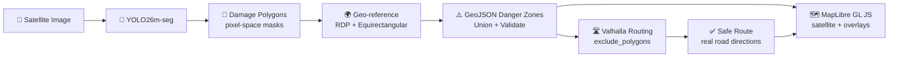
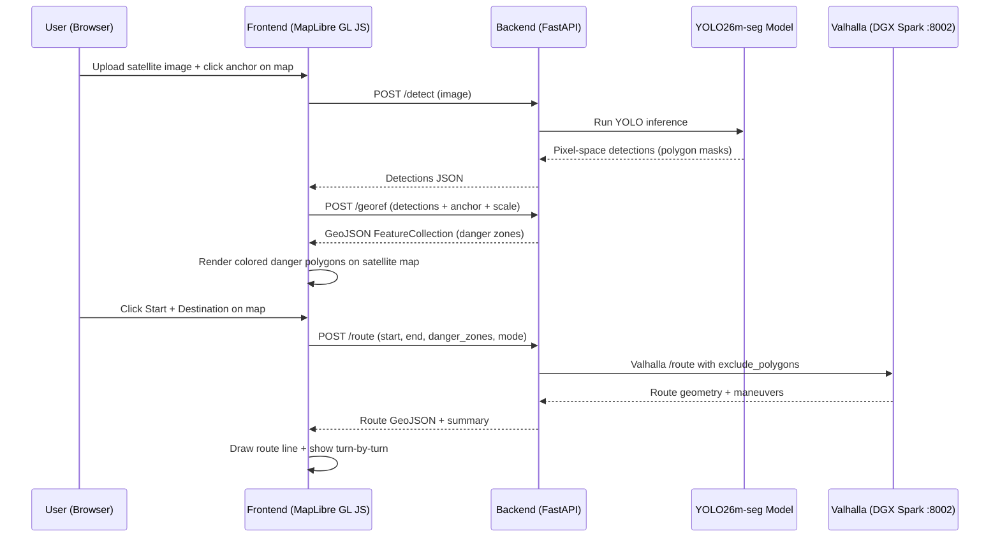

# PathFinder v3 — Satellite-Based Disaster Navigation System

## Project Idea

### The Problem

When a natural disaster strikes — an earthquake, hurricane, volcanic eruption — NGO volunteers on the ground need to navigate through devastated areas to deliver aid, locate survivors, and coordinate relief. Roads are blocked by collapsed buildings, bridges are destroyed, and entire neighborhoods become impassable. Currently, responders rely on outdated maps and word-of-mouth reports, wasting critical time and risking lives by walking into danger zones they cannot assess remotely.

### The Solution

**PathFinder** is a real-time disaster navigation and situational awareness platform that uses satellite imagery, AI-driven damage detection, and open-source routing to assist NGOs operating in disaster zones.

1. **See the Damage** — A YOLO26m-seg instance segmentation model scans post-disaster satellite images and identifies every damaged building with **exact polygon footprints**, classifying them by severity: _no damage_, _minor_, _major_, or _destroyed_.
2. **Map the Danger** — Those detections are geo-referenced and projected onto a **satellite map** (MapLibre GL JS) as color-coded GeoJSON danger zones (green → yellow → orange → red), giving volunteers an instant tactical overview.
3. **Route Around Danger** — The geo-referenced danger polygons are injected as **`exclude_polygons`** into the **Valhalla** open-source routing engine, which computes the safest route on **real road networks** — not pixel grids.

The result: a volunteer uploads a satellite image, sees exactly where the destruction is, and gets real driving/walking directions from point A to point B that avoid all danger zones — all in seconds.

### Why It Matters

- **Saves lives** by routing people away from structurally compromised areas
- **Saves time** by eliminating manual scouting of blocked routes
- **Real roads** — routes follow actual streets, not pixel paths
- **Scales globally** — works on any satellite imagery, any disaster type
- **Fully open-source** — MapLibre, Valhalla, OpenStreetMap, xView2 dataset

---

## Architecture Overview



---

## What Changed from v2

| v2 (Original) | v3 (Revised) | Rationale |
|:--|:--|:--|
| CesiumJS 3D globe | **MapLibre GL JS** 2D satellite map | Google/Apple Maps feel, fully open-source, no Ion token |
| Pixel-coordinate A\* pathfinding | **Valhalla** open-source routing engine | Real road routing on actual streets |
| Custom danger grid (numpy) | **GeoJSON danger polygons → `exclude_polygons`** | AI injects danger directly into routing algorithm |
| Pixel-space everything | **Geo-referenced coordinates** | Required for real-world routing |
| resium React wrapper | **react-map-gl** React wrapper | Industry-standard MapLibre wrapper by Uber/Visgl |

---

## Infrastructure

### ASUS Ascent GX10 (NVIDIA DGX Spark)

| Spec | Value |
|:--|:--|
| **Chip** | NVIDIA GB10 Grace Blackwell Superchip |
| **GPU** | Integrated Blackwell (1 petaFLOP / 1000 TOPS FP4) |
| **RAM** | 128 GB unified LPDDR5x |
| **Disk** | 916 GB NVMe (835 GB free) |
| **CUDA** | 13.0, Driver 580.126.09 |
| **OS** | Ubuntu Linux (DGX Spark 7.4.0), aarch64 |
| **Network** | Connected via laptop hotspot at `192.168.137.117` |

**Runs**: YOLO training (GPU) + Valhalla routing engine (Docker, CPU)

### Valhalla on DGX Spark

```bash
# On GX10:
mkdir -p ~/valhalla_data && cd ~/valhalla_data
wget https://download.geofabrik.de/central-america-latest.osm.pbf
docker run -dt --name valhalla -p 8002:8002 \
  -v ~/valhalla_data:/custom_files \
  ghcr.io/gis-ops/docker-valhalla/valhalla:latest
```

Valhalla API available at: `http://192.168.137.117:8002`

---

## Team Structure and Responsibilities

### You (AI Lead + Backend)

**Scope**: The brain (damage detection model) AND the spine (API layer).

#### AI Responsibilities — ✅ DONE / IN PROGRESS

| Responsibility | Status |
|:--|:--|
| **Dataset preparation** | ✅ Converted xView2 → YOLO seg format (4,524 images, 322K buildings) |
| **Model fine-tuning** | 🔄 Training YOLO26m-seg on DGX Spark (will export `best.pt`) |
| **Mask quality** | Pending — validate after training completes |
| **Demo images** | Pending — prepare 2–3 with known geo-locations |

#### Backend Responsibilities — TODO

| Responsibility | Details |
|:--|:--|
| **FastAPI server** | Build `main.py` with CORS, all endpoints |
| **`POST /detect`** | Stub first → wire to `best.pt` when ready |
| **`POST /georef`** | 4 geometry algorithms (see below) |
| **`POST /route`** | Call Valhalla at `192.168.137.117:8002` with `exclude_polygons` |
| **`CRUD /missions`** | Save/load missions to Supabase |
| **Error handling** | Input validation, graceful error responses |

**Tech**: Python, FastAPI, Pydantic v2, httpx, Shapely, Supabase, Valhalla API

**Deliverables**: Trained `best.pt`, working API server, Valhalla integration

---

## The 4 Critical Geometry Algorithms

YOLO outputs **raster masks** (pixel grids). Valhalla expects **vector coordinates** (lat/lng polygons). These algorithms bridge the gap in `POST /georef`:

### A. Mask-to-Polygon Extraction (`detect.py`)

- Ultralytics `results[0].masks.xy` extracts polygon vertices directly
- Fallback: Suzuki's Algorithm via `cv2.findContours` for raw tensors

### B. Polygon Simplification — Ramer-Douglas-Peucker (`georef.py`)

- YOLO masks have thousands of jagged vertices → Valhalla will choke
- `poly.simplify(tolerance=2.0, preserve_topology=True)` reduces by ~90%

### C. Spatial Translation — Equirectangular Approximation (`georef.py`)

```python
dx_meters = (px_x - center_x) * scale
dy_meters = (center_y - px_y) * scale  # Y is flipped
lat = anchor_lat + (dy_meters / 111_320)
lng = anchor_lng + (dx_meters / (111_320 * cos(radians(anchor_lat))))
```

### D. Polygon Union — Cascaded Boolean Union (`georef.py`)

- Overlapping danger zones cause Valhalla graph-cutting errors
- `shapely.ops.unary_union(polygons)` dissolves overlaps into clean features

---

### Person B — Frontend Engineer

**Scope**: The face — a clean, Google/Apple Maps-style interface with satellite imagery, danger overlays, and route visualization.

| Responsibility | Details |
|:--|:--|
| **Next.js app scaffold** | Initialize with TypeScript, Tailwind 4, App Router |
| **MapLibre GL JS map** | Satellite imagery base layer via Esri tiles, WebGL-accelerated |
| **Map/Satellite toggle** | Switch between street map and satellite view (like Google Maps) |
| **Danger zone overlay** | Render GeoJSON danger polygons as colored fill layers |
| **Route rendering** | Draw Valhalla route as a line layer on the map |
| **Image upload UI** | Drag-and-drop component → `POST /detect` |
| **Click-to-place markers** | Start (green) and Destination (red) markers on map click |
| **Sidebar controls** | Damage legend, route summary, transport mode selector |
| **Mission dashboard** | List saved missions, click to reload |

**Tech**: TypeScript, React 19, Next.js 15, MapLibre GL JS, react-map-gl, Tailwind CSS 4

**Deliverables**: Complete web app with satellite map, danger overlays, route visualization, dashboard

---

## Project Directory Structure

```
d:\School_Project\Yhacks\
|
+-- ai/                              <-- YOU (AI Lead)
|   +-- scripts/
|   |   +-- convert_xview2_to_yolo_seg.py
|   +-- training/
|   |   +-- train.py
|   |   +-- data.yaml
|   +-- weights/
|       +-- best.pt
|
+-- backend/                         <-- PERSON A (Backend Engineer)
|   +-- app/
|   |   +-- main.py                      # FastAPI app + CORS
|   |   +-- config.py                    # Environment variables
|   |   +-- models.py                    # Pydantic schemas
|   |   +-- database.py                  # Supabase client
|   |   +-- routes/
|   |       +-- detect.py                # POST /detect (YOLO inference)
|   |       +-- georef.py                # POST /georef (pixel → GeoJSON)
|   |       +-- route.py                 # POST /route (Valhalla routing)
|   |       +-- missions.py             # CRUD /missions
|   +-- tests/
|   +-- requirements.txt
|
+-- frontend/                        <-- PERSON B (Frontend Engineer)
|   +-- src/
|   |   +-- app/
|   |   |   +-- page.tsx                 # Dashboard
|   |   |   +-- layout.tsx               # Root layout
|   |   |   +-- globals.css
|   |   |   +-- mission/
|   |   |       +-- page.tsx             # Main map view
|   |   +-- components/
|   |   |   +-- MapView.tsx              # MapLibre GL JS wrapper
|   |   |   +-- DangerLayer.tsx          # GeoJSON danger zone fill layers
|   |   |   +-- RouteLayer.tsx           # Route line layer
|   |   |   +-- ImageUpload.tsx          # Drag-and-drop upload
|   |   |   +-- MapControls.tsx          # Zoom, layer toggle
|   |   |   +-- Sidebar.tsx              # Controls panel
|   |   +-- lib/
|   |       +-- api.ts                   # Backend fetch wrappers
|   |       +-- mapStyle.ts              # Satellite + street tile configs
|   +-- package.json
|   +-- tailwind.config.ts
|
+-- data/                            <-- SHARED
+-- docs/                            <-- SHARED
+-- README.md
```

---

## Shared Contracts (JSON Schemas)

### Detection Object (pixel-space, from YOLO)

```json
{
  "mask": [[x1, y1], [x2, y2], [x3, y3], "..."],
  "class": "destroyed",
  "class_id": 3,
  "danger_weight": 10,
  "confidence": 0.92
}
```

### Damage Class Mapping

| subtype | class_id | Color | Danger Weight |
|:--|:--|:--|:--|
| `no-damage` | 0 | Green `#22c55e` | 1× |
| `minor-damage` | 1 | Yellow `#eab308` | 3× |
| `major-damage` | 2 | Orange `#f97316` | 6× |
| `destroyed` | 3 | Red `#ef4444` | 10× |

### Danger Zone (GeoJSON, geo-referenced)

```json
{
  "type": "Feature",
  "geometry": {
    "type": "Polygon",
    "coordinates": [[[lng1, lat1], [lng2, lat2], "..."]]
  },
  "properties": {
    "severity": "destroyed",
    "class_id": 3,
    "danger_weight": 10,
    "confidence": 0.92
  }
}
```

### Route Response (from Valhalla)

```json
{
  "route": {
    "type": "Feature",
    "geometry": {
      "type": "LineString",
      "coordinates": [[lng1, lat1], [lng2, lat2], "..."]
    }
  },
  "summary": {
    "distance_km": 2.4,
    "time_minutes": 12.3,
    "danger_zones_avoided": 3
  },
  "maneuvers": [
    { "instruction": "Turn left onto Main St", "distance": 0.3 }
  ]
}
```

---

## Integration Data Flow



---

## Phased Timeline

### Phase 1 — Stubs + Scaffold (NOW, ~45 min)

| You (AI + Backend) | Person B (Frontend) |
|:--|:--|
| ✅ Dataset converted (4,524 images) | Scaffold Next.js project |
| 🔄 YOLO26m-seg training on DGX Spark | Set up MapLibre GL JS + satellite tiles |
| Build FastAPI scaffold + stub endpoints | Build `ImageUpload.tsx` |
| Stub `/detect`, `/georef`, `/route` (mock data) | Wire upload → `/detect` → render |

### Phase 2 — Geo-referencing + Valhalla (~1.5 hr)

| You (AI + Backend) | Person B (Frontend) |
|:--|:--|
| Implement real `/georef` (RDP + equirectangular + union) | Build `DangerLayer.tsx` (GeoJSON fills) |
| Set up Valhalla on DGX Spark (Docker) | Build `RouteLayer.tsx` + click markers |
| Implement real `/route` with Valhalla | Sidebar controls, transport mode |

### Phase 3 — Real Model + Polish

| You (AI + Backend) | Person B (Frontend) |
|:--|:--|
| Export `best.pt`, wire real `/detect` | Dashboard with saved missions |
| Set up Supabase + `/missions` CRUD | Map/Satellite toggle, sidebar polish |
| Pre-process 3 demo images | Final UX polish, responsive layout |
| Test full pipeline end-to-end | Loading states, animations |

---

## Verification Plan

### Automated Tests

| What | Command | Owner |
|:--|:--|:--|
| Label conversion check | `python ai/scripts/convert_xview2_to_yolo_seg.py --validate` | You |
| YOLO 1-epoch smoke test | `python ai/training/train.py --epochs 1` | You |
| API endpoint tests | `cd backend && pytest tests/ -v` | Person A |
| Geo-referencing accuracy | `pytest tests/test_georef.py` | Person A |
| Valhalla integration | `pytest tests/test_valhalla.py` | Person A |
| Frontend build | `cd frontend && npm run build` | Person B |

### Manual / Visual Verification

1. Upload a known `_post_disaster.png` → verify colored polygons appear at correct map location
2. Set start/goal across a danger zone → verify route goes **around** red zones on real streets
3. Toggle Map ↔ Satellite view → verify overlays persist
4. Save a mission, reload the page → verify it appears in dashboard and re-renders correctly

> [!TIP]
> **Demo strategy**: Pre-process 2–3 dramatic images (e.g., guatemala-volcano, hurricane-florence) with known geo-coordinates before the demo so inference and geo-referencing are instant for judges.
