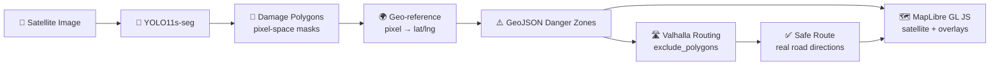
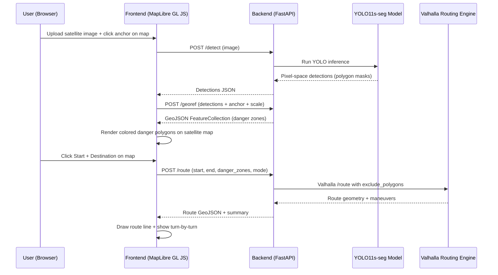

# SafeRoute v3 — Satellite-Based Disaster Navigation System

## Project Idea

### The Problem

When a natural disaster strikes — an earthquake, hurricane, volcanic eruption — NGO volunteers on the ground need to navigate through devastated areas to deliver aid, locate survivors, and coordinate relief. Roads are blocked by collapsed buildings, bridges are destroyed, and entire neighborhoods become impassable. Currently, responders rely on outdated maps and word-of-mouth reports, wasting critical time and risking lives by walking into danger zones they cannot assess remotely.

### The Solution

**SafeRoute** is a real-time disaster navigation and situational awareness platform that uses satellite imagery, AI-driven damage detection, and open-source routing to assist NGOs operating in disaster zones.

1. **See the Damage** — A YOLO11s-seg instance segmentation model scans post-disaster satellite images and identifies every damaged building with **exact polygon footprints**, classifying them by severity: _no damage_, _minor_, _major_, or _destroyed_.
2. **Map the Danger** — Those detections are geo-referenced and projected onto a **satellite map** (MapLibre GL JS) as color-coded GeoJSON danger zones (green → yellow → orange → red), giving volunteers an instant tactical overview.
3. **Route Around Danger** — The geo-referenced danger polygons are injected as **`exclude_polygons`** into the **Valhalla** open-source routing engine, which computes the safest route on **real road networks** — not pixel grids.

The result: a volunteer uploads a satellite image, sees exactly where the destruction is, and gets real driving/walking directions from point A to point B that avoid all danger zones — all in seconds.

### Why It Matters

- **Saves lives** by routing people away from structurally compromised areas
- **Saves time** by eliminating manual scouting of blocked routes
- **Real roads** — routes follow actual streets, not pixel paths
- **Scales globally** — works on any satellite imagery, any disaster type
- **Fully open-source** — MapLibre, Valhalla, OpenStreetMap, xView2 dataset

---

## Architecture Overview



---

## What Changed from v2

| v2 (Original) | v3 (Revised) | Rationale |
|:--|:--|:--|
| CesiumJS 3D globe | **MapLibre GL JS** 2D satellite map | Google/Apple Maps feel, fully open-source, no Ion token |
| Pixel-coordinate A\* pathfinding | **Valhalla** open-source routing engine | Real road routing on actual streets |
| Custom danger grid (numpy) | **GeoJSON danger polygons → `exclude_polygons`** | AI injects danger directly into routing algorithm |
| Pixel-space everything | **Geo-referenced coordinates** | Required for real-world routing |
| resium React wrapper | **react-map-gl** React wrapper | Industry-standard MapLibre wrapper by Uber/Visgl |

---

## Team Structure and Responsibilities

### You (AI and Pathfinding Lead)

**Scope**: The brain of the system — the damage detection model.

| Responsibility | Details |
|:--|:--|
| **Dataset preparation** | Convert xView2 GeoJSON labels to YOLO segmentation format. Convert **both** pre- and post-disaster to avoid bias |
| **Model fine-tuning** | Fine-tune YOLO11s-seg on xView2, tune hyperparameters, validate mask mAP |
| **Mask quality** | Ensure output polygons are clean (no self-intersections), suitable for geo-referencing |
| **Model serving** | Package `best.pt` so the backend can call it for inference |
| **Demo images** | Prepare 2–3 pre-processed demo images with known geo-locations |

> **Note**: The custom A\* pathfinding module is **no longer needed**. Valhalla handles all routing. Your focus shifts entirely to maximizing YOLO mask accuracy.

**Deliverables**: Trained `best.pt` weights, `convert_xview2_to_yolo_seg.py` script, 3 demo images with geo-coordinates

---

### Person A — Backend Engineer

**Scope**: The spine — API layer, geo-referencing pipeline, Valhalla integration, and database.

| Responsibility | Details |
|:--|:--|
| **FastAPI server** | Build and maintain `main.py` with all API endpoints |
| **`POST /detect`** | Accept image upload, call YOLO model, return pixel-space detections |
| **`POST /georef`** | **NEW**: Convert pixel masks → GeoJSON lat/lng polygons using anchor + scale |
| **`POST /route`** | **Revised**: Call Valhalla with `exclude_polygons` for danger avoidance |
| **`CRUD /missions`** | Save/load missions to Supabase |
| **Valhalla integration** | Configure Valhalla API (hosted or Docker), handle `exclude_polygons` |
| **Database schema** | Supabase `missions` table |
| **Error handling** | Input validation, graceful error responses |

**Tech**: Python, FastAPI, Pydantic v2, httpx, Shapely, Supabase, Valhalla API

**Deliverables**: Working API server with all endpoints, Valhalla integration, Supabase schema

---

### Person B — Frontend Engineer

**Scope**: The face — a clean, Google/Apple Maps-style interface with satellite imagery, danger overlays, and route visualization.

| Responsibility | Details |
|:--|:--|
| **Next.js app scaffold** | Initialize with TypeScript, Tailwind 4, App Router |
| **MapLibre GL JS map** | Satellite imagery base layer via Esri tiles, WebGL-accelerated |
| **Map/Satellite toggle** | Switch between street map and satellite view (like Google Maps) |
| **Danger zone overlay** | Render GeoJSON danger polygons as colored fill layers |
| **Route rendering** | Draw Valhalla route as a line layer on the map |
| **Image upload UI** | Drag-and-drop component → `POST /detect` |
| **Click-to-place markers** | Start (green) and Destination (red) markers on map click |
| **Sidebar controls** | Damage legend, route summary, transport mode selector |
| **Mission dashboard** | List saved missions, click to reload |

**Tech**: TypeScript, React 19, Next.js 15, MapLibre GL JS, react-map-gl, Tailwind CSS 4

**Deliverables**: Complete web app with satellite map, danger overlays, route visualization, dashboard

---

## Project Directory Structure

```
d:\School_Project\Yhacks\
|
+-- ai/                              <-- YOU (AI Lead)
|   +-- scripts/
|   |   +-- convert_xview2_to_yolo_seg.py
|   +-- training/
|   |   +-- train.py
|   |   +-- data.yaml
|   +-- weights/
|       +-- best.pt
|
+-- backend/                         <-- PERSON A (Backend Engineer)
|   +-- app/
|   |   +-- main.py                      # FastAPI app + CORS
|   |   +-- config.py                    # Environment variables
|   |   +-- models.py                    # Pydantic schemas
|   |   +-- database.py                  # Supabase client
|   |   +-- routes/
|   |       +-- detect.py                # POST /detect (YOLO inference)
|   |       +-- georef.py                # POST /georef (pixel → GeoJSON)
|   |       +-- route.py                 # POST /route (Valhalla routing)
|   |       +-- missions.py             # CRUD /missions
|   +-- tests/
|   +-- requirements.txt
|
+-- frontend/                        <-- PERSON B (Frontend Engineer)
|   +-- src/
|   |   +-- app/
|   |   |   +-- page.tsx                 # Dashboard
|   |   |   +-- layout.tsx               # Root layout
|   |   |   +-- globals.css
|   |   |   +-- mission/
|   |   |       +-- page.tsx             # Main map view
|   |   +-- components/
|   |   |   +-- MapView.tsx              # MapLibre GL JS wrapper
|   |   |   +-- DangerLayer.tsx          # GeoJSON danger zone fill layers
|   |   |   +-- RouteLayer.tsx           # Route line layer
|   |   |   +-- ImageUpload.tsx          # Drag-and-drop upload
|   |   |   +-- MapControls.tsx          # Zoom, layer toggle
|   |   |   +-- Sidebar.tsx              # Controls panel
|   |   +-- lib/
|   |       +-- api.ts                   # Backend fetch wrappers
|   |       +-- mapStyle.ts              # Satellite + street tile configs
|   +-- package.json
|   +-- tailwind.config.ts
|
+-- data/                            <-- SHARED
+-- docs/                            <-- SHARED
+-- README.md
```

---

## Shared Contracts (JSON Schemas)

### Detection Object (pixel-space, from YOLO)

```json
{
  "mask": [[x1, y1], [x2, y2], [x3, y3], "..."],
  "class": "destroyed",
  "class_id": 3,
  "danger_weight": 10,
  "confidence": 0.92
}
```

### Damage Class Mapping

| subtype | class_id | Color | Danger Weight |
|:--|:--|:--|:--|
| `no-damage` | 0 | Green `#22c55e` | 1× |
| `minor-damage` | 1 | Yellow `#eab308` | 3× |
| `major-damage` | 2 | Orange `#f97316` | 6× |
| `destroyed` | 3 | Red `#ef4444` | 10× |

### Danger Zone (GeoJSON, geo-referenced)

```json
{
  "type": "Feature",
  "geometry": {
    "type": "Polygon",
    "coordinates": [[[lng1, lat1], [lng2, lat2], "..."]]
  },
  "properties": {
    "severity": "destroyed",
    "class_id": 3,
    "danger_weight": 10,
    "confidence": 0.92
  }
}
```

### Route Response (from Valhalla)

```json
{
  "route": {
    "type": "Feature",
    "geometry": {
      "type": "LineString",
      "coordinates": [[lng1, lat1], [lng2, lat2], "..."]
    }
  },
  "summary": {
    "distance_km": 2.4,
    "time_minutes": 12.3,
    "danger_zones_avoided": 3
  },
  "maneuvers": [
    { "instruction": "Turn left onto Main St", "distance": 0.3 }
  ]
}
```

---

## Integration Data Flow



---

## Phased Timeline (2-Day Hackathon)

### Phase 1 — Foundation (Day 1, first half)

| You (AI) | Person A (Backend) | Person B (Frontend) |
|:--|:--|:--|
| Run `convert_xview2_to_yolo.py` | Scaffold FastAPI project | Scaffold Next.js project |
| Start YOLO training | Create stub `/detect` endpoint | Set up MapLibre GL JS + satellite tiles |
| Draft `data.yaml` | Test Valhalla API connectivity | Build `ImageUpload.tsx` |

### Phase 2 — Core Integration (Day 1, second half)

| You (AI) | Person A (Backend) | Person B (Frontend) |
|:--|:--|:--|
| Validate training metrics | Wire `/detect` to real YOLO model | Wire upload → `/detect` → render detections |
| Ensure clean mask polygons | Build `POST /georef` endpoint | Build `DangerLayer.tsx` (GeoJSON fills) |
| Prepare demo image geo-coords | Build `POST /route` with Valhalla | Build `RouteLayer.tsx` + click markers |

### Phase 3 — Polish and Demo Prep (Day 2)

| You (AI) | Person A (Backend) | Person B (Frontend) |
|:--|:--|:--|
| Tune model, improve mAP | Error handling, input validation | Dashboard with saved missions |
| Pre-process 3 demo images | `/missions` CRUD endpoints | Map/Satellite toggle, sidebar polish |
| Test full pipeline end-to-end | Deploy API (Railway / Render) | Final UX polish, responsive layout |

---

## Verification Plan

### Automated Tests

| What | Command | Owner |
|:--|:--|:--|
| Label conversion check | `python ai/scripts/convert_xview2_to_yolo_seg.py --validate` | You |
| YOLO 1-epoch smoke test | `python ai/training/train.py --epochs 1` | You |
| API endpoint tests | `cd backend && pytest tests/ -v` | Person A |
| Geo-referencing accuracy | `pytest tests/test_georef.py` | Person A |
| Valhalla integration | `pytest tests/test_valhalla.py` | Person A |
| Frontend build | `cd frontend && npm run build` | Person B |

### Manual / Visual Verification

1. Upload a known `_post_disaster.png` → verify colored polygons appear at correct map location
2. Set start/goal across a danger zone → verify route goes **around** red zones on real streets
3. Toggle Map ↔ Satellite view → verify overlays persist
4. Save a mission, reload the page → verify it appears in dashboard and re-renders correctly

> [!TIP]
> **Demo strategy**: Pre-process 2–3 dramatic images (e.g., guatemala-volcano, hurricane-florence) with known geo-coordinates before the demo so inference and geo-referencing are instant for judges.
