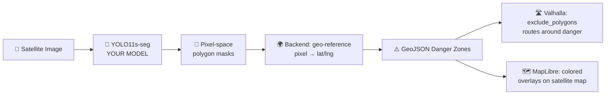

# SafeRoute — AI & Pathfinding Lead (Your Plan)

## Your Role

You are the brain of the system. You own everything that **thinks**: the damage detection model and the dataset pipeline. Your YOLO polygon masks are the foundation — they become the danger zones that the routing engine avoids. The better your masks, the more accurate the safe routes.

> **What changed from v2**: The custom A\* pathfinding module is **no longer needed**. Valhalla (an open-source routing engine) now handles all routing on real road networks. Your polygon masks are geo-referenced and fed directly to Valhalla as `exclude_polygons`. This means your sole focus is **maximizing mask accuracy** — clean, precise polygon footprints are critical.

---

## Key Decision: Instance Segmentation over Object Detection

> **Use YOLO11s-seg (Instance Segmentation), NOT standard bounding-box detection.**

| | Object Detection (bbox) | Instance Segmentation (polygon) |
|---|---|---|
| Output shape | Rectangles around buildings | **Exact polygon footprint** of each building |
| xView2 label format | Would need bbox conversion (lossy) | **Native match** — xView2 provides WKT polygons |
| Danger zone accuracy | Rectangles overlap streets → false blockages | **Pixel-precise** rubble footprint, streets stay open |
| Routing impact | Valhalla avoids entire rectangular blocks | Valhalla only avoids **actual rubble**, finds more routes |
| Model | `yolo26s.pt` | **`yolo11s-seg.pt`** (Ultralytics, segment-aware) |

**Bottom line**: Your xView2 labels are polygons. Train a model that outputs polygons. The danger zones become surgically accurate, and Valhalla can route around them precisely.

---

## How Your Work Connects to the System



Your `best.pt` model outputs polygon masks in pixel coordinates. The backend then:
1. Geo-references them (pixel → lat/lng) using the image's anchor point and scale
2. Sends the GeoJSON polygons to the frontend for visualization
3. Feeds them to Valhalla as `exclude_polygons` for safe routing

**Your masks directly become the avoidance zones.** A self-intersecting or noisy polygon = a broken danger zone = a bad route.

---

## Phase 1 — Dataset Preparation

### Step 1: Convert xView2 → YOLO Segmentation Format

**File**: `ai/scripts/convert_xview2_to_yolo_seg.py`

The xView2 labels provide building polygons as WKT in pixel coordinates (`xy` field). YOLO segmentation format needs:

```
class_id x1 y1 x2 y2 x3 y3 ... xn yn
```

Where all coordinates are normalized to `[0, 1]` (divide by image width/height = 1024).

**Conversion logic**:

```python
# For each _post_disaster.json label file:
# 1. Parse the JSON
# 2. For each feature in ["features"]["xy"]:
#    a. Extract the "subtype" → map to class_id
#    b. Parse the WKT polygon → extract vertex coordinates
#    c. Normalize vertices by dividing by 1024
#    d. Write: class_id x1 y1 x2 y2 ... xn yn
# 3. Save as .txt with same filename as the image
```

**Class mapping**:

| xView2 `subtype` | `class_id` | Danger Weight |
|---|---|---|
| `no-damage` | 0 | 1× |
| `minor-damage` | 1 | 3× |
| `major-damage` | 2 | 6× |
| `destroyed` | 3 | 10× |
| `un-classified` | — | **skip** |

**Important details**:

- Convert **both** `_post_disaster` AND `_pre_disaster` files to avoid bias
  - `_post_disaster`: use the `subtype` field → map to class 0–3
  - `_pre_disaster`: no `subtype` field exists → label **all** buildings as class `0` (no-damage)
  - This doubles your dataset and gives the model balanced exposure to intact vs. damaged buildings
- Use the `xy` field (pixel coords), not `lng_lat` (geo coords)
- WKT format is `POLYGON ((x1 y1, x2 y2, ...))` — parse with `shapely.wkt.loads()`
- Split into 80% train / 20% val

### Step 2: Generate `data.yaml`

```yaml
path: d:/School_Project/Yhacks/data/yolo_seg
train: images/train
val: images/val

names:
  0: no-damage
  1: minor-damage
  2: major-damage
  3: destroyed
```

### Step 3: Validate the conversion

- Spot-check 5 label files: each line should have `class_id` followed by an even number of floats in `[0, 1]`
- Visually overlay polygons on a sample image to verify alignment
- **NEW**: Verify that polygon outputs are **valid** (no self-intersections) using `shapely.validation.make_valid()`

---

## Phase 2 — Model Training

### Step 1: Fine-tune YOLO11s-seg

**File**: `ai/training/train.py`

```python
from ultralytics import YOLO

model = YOLO("yolo11s-seg.pt")  # Instance segmentation, small variant
model.train(
    data="data.yaml",
    imgsz=1024,              # Native xView2 resolution
    epochs=50,               # Increase if time allows
    batch=4,                 # Adjust to GPU VRAM (4 for 8GB, 8 for 16GB)
    optimizer="auto",        # Let Ultralytics pick best optimizer
    device=0,                # GPU index
    project="runs/seg",
    name="yolo11s_xview2_seg",
    patience=10,             # Early stopping
    augment=True,            # Mosaic + mixup for small dataset
)
```

### Step 2: Evaluate

After training completes, check:

- **mAP50-95 (mask)** — target ≥ 0.40 for a hackathon
- **Per-class AP** — make sure `destroyed` class isn't being ignored
- **Visual inference** — run on 3 test images, manually verify polygons
- **NEW**: Check that output polygons are **simple** (no self-intersections) — the backend will use them as GeoJSON, and Valhalla will use them as exclusion zones. Invalid polygons = routing failures.

```python
model = YOLO("runs/seg/yolo11s_xview2_seg/weights/best.pt")
results = model.predict("path/to/test_image.png", save=True, conf=0.3)

# Validate polygon geometry
from shapely.geometry import Polygon
from shapely.validation import make_valid

for mask in results[0].masks.xy:
    poly = Polygon(mask.tolist())
    if not poly.is_valid:
        print(f"WARNING: Invalid polygon detected, needs cleanup")
        poly = make_valid(poly)
```

### Step 3: Export `best.pt`

Copy the final weights to your shared location:

```
ai/weights/best.pt
```

This file is what Person A's backend will load for inference.

---

## Phase 3 — Demo Image Preparation

> **This replaces the old "Pathfinding" phase.** Since Valhalla handles routing, your Phase 3 is preparing demo-ready content.

### Step 1: Select 2–3 Dramatic Demo Images

Choose images from the xView2 dataset that show clear damage patterns:

- Guatemala Volcano
- Hurricane Florence
- Hurricane Michael

### Step 2: Record Geo-Coordinates for Each Image

For each demo image, you need to provide:

```python
demo_images = [
    {
        "filename": "guatemala-volcano_post_disaster.png",
        "anchor": {"lat": 14.4747, "lng": -90.8806},  # Center of image
        "scale": 0.3,  # meters per pixel (depends on satellite resolution)
        "description": "Guatemala Fuego volcano eruption, 2018"
    },
    {
        "filename": "hurricane-florence_post_disaster.png",
        "anchor": {"lat": 34.2257, "lng": -77.9447},
        "scale": 0.3,
        "description": "Hurricane Florence, North Carolina, 2018"
    }
]
```

> [!TIP]
> The xView2 label JSON files contain a `lng_lat` field with geographic coordinates. Use these to determine the anchor point and scale for each demo image.

### Step 3: Pre-run Inference on Demo Images

Run your model on each demo image ahead of time so the demo is instant:

```python
model = YOLO("ai/weights/best.pt")
for img in demo_images:
    results = model.predict(img["filename"], conf=0.3, save=True)
    # Save detections as JSON for quick loading during demo
    save_detections_json(results, f"demo_{img['filename']}.json")
```

---

## Your Deliverables Checklist

```
- [ ] ai/scripts/convert_xview2_to_yolo_seg.py  (dataset converter)
- [ ] ai/training/train.py                       (training script)
- [ ] ai/training/data.yaml                      (dataset config)
- [ ] ai/weights/best.pt                         (trained weights)
- [ ] ai/demo/                                   (pre-processed demo images + geo-coords)
- [ ] Polygon validation (no self-intersections)
```

> [!IMPORTANT]
> **Removed deliverables**: `ai/pathfinding/grid.py` and `ai/pathfinding/astar.py` are **no longer needed**. Valhalla handles all routing. Do not build these.

---

## What You Need From Your Teammates

| From | What | When |
|---|---|---|
| Person A | A working `POST /detect` stub (mock data) so you can test model integration | Day 1, first half |
| Person A | Confirmation that the geo-referencing pipeline works with your mask format | Day 1, second half |
| Person B | Nothing directly — coordinate on detection JSON schema early | Day 1, first half |

---

## Timeline

| When | What |
|---|---|
| Day 1, Hour 1–2 | Write & run `convert_xview2_to_yolo_seg.py`, validate output |
| Day 1, Hour 2–4 | Start YOLO11s-seg training (runs in background on GPU) |
| Day 1, Hour 4–6 | While training: validate polygon quality, prepare demo image geo-coords |
| Day 1, Hour 6–8 | Training done → evaluate, possibly retrain with tuned params |
| Day 2, Hour 1–3 | Integration: test full pipeline (image → detections → geo-ref → map) |
| Day 2, Hour 3–5 | Pre-process 3 demo images, tune confidence threshold |
| Day 2, Hour 5+ | Demo prep, edge case fixes |
